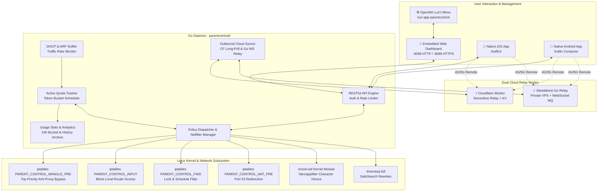

<div align="center">

# 🛡️ ParentControl Guard

**Next-Generation Parental Control, Deep Packet Inspection (DPI) & Application Security System for OpenWrt**

[](https://github.com/hamguy/parent-control/actions/workflows/ci.yml)
[](https://github.com/hamguy/parent-control/actions/workflows/release.yml)
[](https://golang.org)
[](https://swift.org)
[](https://openwrt.org)
[](LICENSE)
[](https://github.com/hamguy/parent-control/releases)
[](CONTRIBUTING.md)

[English](README.md) | [简体中文](README_zh.md)

</div>

---

## 📖 Overview

**ParentControl Guard** is an enterprise-grade, lightweight, and fine-grained parental control & traffic policy system designed for **OpenWrt** routers and embedded gateway devices.

Powered by a high-efficiency **Go** backend daemon and the **`kmod-oaf`** Layer-7 Deep Packet Inspection (DPI) kernel engine, ParentControl Guard provides comprehensive protection against digital distractions, gaming addiction, and inappropriate content—with zero performance compromises on low-resource routers.

It includes a self-hosted, embedded **Web Dashboard**, native **iOS (SwiftUI)** and **Android** clients sharing a pure **Swift** business core, and an optional **Cloudflare Worker** serverless relay for secure out-of-home remote policy management over 4G/5G networks.

---

## ✨ Key Features

| Category | Highlights |
| :--- | :--- |
| 📱 **Web Dashboard** | Embedded single-binary Web UI, zero runtime dependencies, dark/light theme, PIN lock protection, multi-language support (8 locales). |
| 🍎 **Native Mobile Apps** | Pure **SwiftUI** for iOS and Kotlin Compose for Android, sharing a cross-platform pure **Swift** core library (`ParentControlCore`) via C-FFI / JNI. |
| 🎮 **Kernel L7 DPI Engine** | Accurate packet-level signature classification (`kmod-oaf`) across hundreds of apps (Steam, TikTok, YouTube, Discord, Honor of Kings, Genshin Impact). |
| ⏱️ **Schedules & Quotas** | Multi-interval time windows with overnight span support, human-active traffic token bucket daily limits, instant Internet lock, and bonus time rewards (+15m, +30m, +1h). |
| 🛡️ **Multi-Layer Defense** | Top-priority `mangle` PREROUTING drop (prevents OpenClash / Passwall proxy bypass), SafeSearch on Google/Bing/Baidu, forced port 53 DNS redirection, blocked DoH/DoT (853/443), and MAC randomization quarantine. |
| 📊 **Usage Analytics & Profile** | 24-hour activity distribution histograms, DPI category breakdown, and 30-day historical usage trends with background noise filtering. |
| ☁️ **Dual Cloud Relay Modes** | Serverless **Cloudflare Workers & KV** relay + standalone **Go Relay Server** (In-Memory MQ + WebSocket) for private VPS deployments. |
| ⚙️ **OpenWrt Integration** | Native `luci-app-parentcontrol` LuCI administration menu, `procd` init service, and automated IPK packaging. |

---

## 🖼️ UI Screenshots & Gallery

<div align="center">

### 📱 Modern Web Dashboard (Desktop)

| 🔒 PIN Security Lock Verification | 📊 Overview Dashboard & Family Cards |
| :---: | :---: |
|  |  |

| 🌐 Discovered LAN Devices & 1-Click Lock | 🎮 Deep L7 DPI App Signatures (8 Categories) |
| :---: | :---: |
|  |  |

| ⏱️ Multi-Schedule Rules & Time Ranges | ⚙️ Global Security, Anti-Bypass & VPS Sync |
| :---: | :---: |
|  |  |

### 📱 Mobile-First Responsive View

| 📲 Responsive Layout (390x844 iPhone Viewport) |
| :---: |
|  |

</div>

---

## 🏛️ System Architecture



---

## 📁 Repository Organization

```text
.
├── cmd/
│   └── parentcontrold/          # Main Go daemon entrypoint
├── internal/
│   ├── api/                     # RESTful API router, middleware & TLS helper
│   ├── cloud/                   # Cloudflare Worker syncer & command consumer
│   ├── config/                  # JSON configuration manager
│   ├── device/                  # DHCP lease & ARP table sniffer
│   ├── dpi/                     # kmod-oaf DPI engine interface & feature parser
│   ├── firewall/                # iptables custom chain & NAT rule manager
│   ├── models/                  # Core domain models and JSON definitions
│   ├── quota/                   # Active time counter & schedule engine
│   └── safedns/                 # SafeSearch dnsmasq rule generator & DoH blocker
├── web/                         # Embedded responsive Web UI (HTML5, Tailwind, Lucide)
├── client/
│   ├── ParentControlCore/       # Shared pure Swift package (Models, API, JNI C-FFI)
│   ├── iOS/                     # Native iOS SwiftUI client project (XcodeGen & .xcodeproj)
│   └── Android/                 # Native Android client (Kotlin, Jetpack Compose, JNI)
├── cloud/
│   └── worker/                  # Cloudflare Worker serverless relay (TypeScript & Wrangler)
├── rootfs/                      # OpenWrt filesystem files (init.d service, LuCI menu & ACL)
├── docs/                        # In-depth architectural & API documentation
├── scripts/                     # Automated compilation and deployment scripts
├── .github/                     # GitHub Actions CI/CD workflows
├── Makefile                     # Make compilation & packaging targets
├── LICENSE                      # MIT License
└── README.md
```

---

## 🚀 Quick Start & Installation

### Option 1: Install Pre-built IPK (Recommended for Users)

Download the matching `.ipk` package for your router architecture from [GitHub Releases](../../releases):

```bash
# Upload to router and install
scp luci-app-parentcontrol_1.0.0-1_x86_64.ipk root@192.168.1.1:/tmp/
ssh root@192.168.1.1

# Install package on OpenWrt
opkg update
opkg install /tmp/luci-app-parentcontrol_1.0.0-1_x86_64.ipk

# Enable and start service
/etc/init.d/parentcontrol enable
/etc/init.d/parentcontrol start
```

### Option 2: Automated One-Click Deployment (For Developers)

Clone the repository and run the automated deployment script directly to your router:

```bash
git clone https://github.com/hamguy/parent-control.git
cd parent-control

# Set execution permissions and deploy
chmod +x scripts/deploy.sh
./scripts/deploy.sh
```

### Option 3: Cross-Compile via Makefile

```bash
# Build daemon for Linux amd64
make build

# Build IPK package for target architecture (e.g., aarch64, mips_24kc, x86_64)
make ipk ARCH=aarch64 VERSION=1.0.0-1

# Run unit tests
make test
```

---

## 📱 Mobile Clients

### 🍏 iOS Client (SwiftUI)
- **Requirements**: iOS 16.0+, macOS Sonoma+, Xcode 15+
- **Open Project**: Open `client/iOS/ParentControl.xcodeproj` in Xcode.
- **Regenerate Project**: (Optional) Run `cd client/iOS && xcodegen generate`.
- **Features**: Native haptic feedback, dark mode, router auto-discovery, PIN screen, and offline cache.

### 🤖 Android Client (Jetpack Compose)
- **Requirements**: Android 8.0+ (API Level 26+), Android Studio Hedgehog+
- **Open Project**: Open `client/Android` in Android Studio.
- **Swift Core Sharing**: Powered by `libParentControlBridge.so` generated from `client/ParentControlCore`. See [Android Swift Interop Guide](docs/ANDROID_SWIFT_INTEROP.md) for details.

---

## ☁️ Remote Cloud Sync Setup (Optional)

To manage your home network rules when away on 4G/5G mobile networks:

1. Follow the [Cloudflare Worker Deployment Guide](cloud/worker/README.md) to deploy your free worker:
   ```bash
   cd cloud/worker
   npm install
   npx wrangler kv:namespace create PARENT_CONTROL_KV
   npx wrangler deploy
   ```
2. In the router's Web Console under **Global Settings**, enable **Cloudflare Worker Remote Sync** and enter the Worker URL and Secret Key.

---

## 📚 Documentation Index

| Document | Description |
| :--- | :--- |
| 📐 [Architecture & Design](docs/ARCHITECTURE.md) ([中文版](docs/ARCHITECTURE_zh.md)) | Comprehensive system design, Netfilter packet flow, DPI pipeline, and quota algorithms. |
| 🔌 [RESTful API Reference](docs/API.md) ([中文版](docs/API_zh.md)) | Complete specification for all endpoints, payload structures, headers, and authentication. |
| 🛠️ [Router Deployment & Operations](docs/DEPLOYMENT.md) ([中文版](docs/DEPLOYMENT_zh.md)) | Production deployment guide, init.d lifecycle, firewall diagnostics, and log inspection. |
| 🌐 [Domestic VPS Go Relay Server Guide](docs/DEPLOYMENT_RELAY_SERVER.md) ([中文版](docs/DEPLOYMENT_RELAY_SERVER_zh.md)) | Standalone Go Relay Server with In-Memory PubSub MQ & WebSocket streams for non-CF environments. |
| ❓ [Frequently Asked Questions (FAQ)](docs/FAQ.md) ([中文版](docs/FAQ_zh.md)) | Troubleshooting guide for SSL certs, MAC randomization, PIN resets, and fallback modes. |
| 🌉 [Android Swift Core Interop](docs/ANDROID_SWIFT_INTEROP.md) ([中文版](docs/ANDROID_SWIFT_INTEROP_zh.md)) | Deep dive into compiling Swift Core to C-FFI / JNI shared libraries for Kotlin consumption. |
| ⚡ [Cloudflare Worker Relay](cloud/worker/README.md) ([中文版](cloud/worker/README_zh.md)) | Serverless relay setup with Wrangler and KV namespace configuration. |

---

## ⚙️ Configuration File Reference

The router configuration is stored at `/etc/parentcontrol/config.json`:

```json
{
  "enabled": true,
  "pin_code": "1234",
  "enforce_safe_search": true,
  "block_doh_dot": true,
  "isolate_new_devices": false,
  "cloud_sync_enabled": false,
  "cloud_worker_url": "",
  "cloud_device_secret": "",
  "members": [
    {
      "id": "m_1",
      "name": "Alex",
      "avatar": "boy",
      "enabled": true,
      "quota_minutes": 120,
      "device_macs": ["AA:BB:CC:DD:EE:FF"],
      "blocked_app_ids": [2001, 2002, 2023],
      "schedule": {
        "enabled": true,
        "days": [1, 2, 3, 4, 5],
        "action": "block",
        "time_ranges": [
          { "start_time": "21:30", "end_time": "07:00" }
        ]
      }
    }
  ]
}
```

---

## 🤝 Contributing

Contributions make the open-source community an amazing place to learn, inspire, and create. Any contributions you make are **greatly appreciated**!

- Read our [Contributing Guidelines](CONTRIBUTING.md) ([中文版](CONTRIBUTING_zh.md)) to get started.
- Check out the [Security Policy](SECURITY.md) ([中文版](SECURITY_zh.md)) for reporting vulnerabilities.

---

## 📄 License

Distributed under the **MIT License**. See [`LICENSE`](LICENSE) for more information.

---

## 💖 Acknowledgments

- [OpenWrt Project](https://openwrt.org/) — The foundation for open wireless router operating systems.
- [kmod-oaf](https://github.com/destan19/OpenAppFilter) — Open App Filter kernel DPI engine.
- [Lucide Icons](https://lucide.dev/) — Beautiful & consistent iconography.
- [Tailwind CSS](https://tailwindcss.com/) — Utility-first modern CSS framework.
