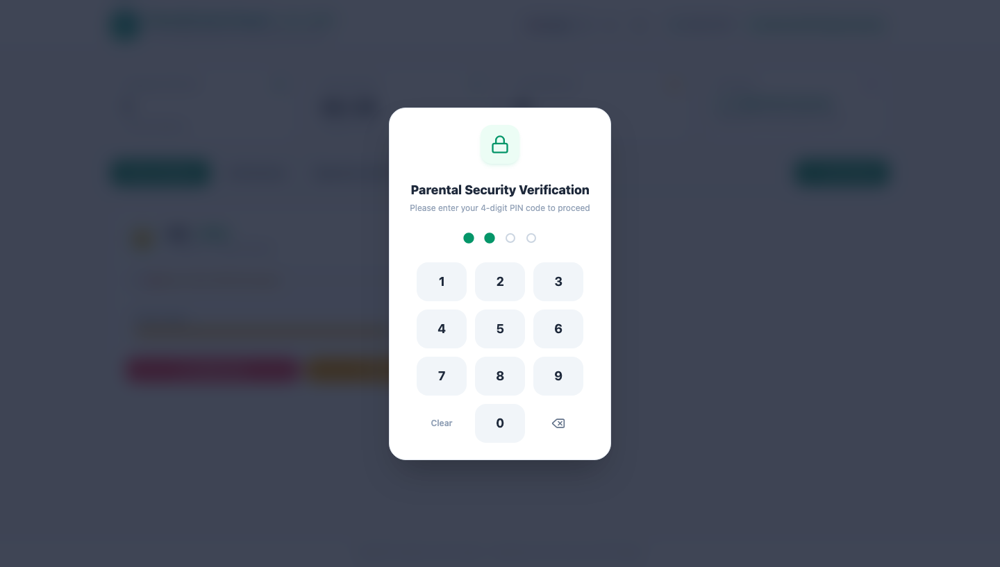
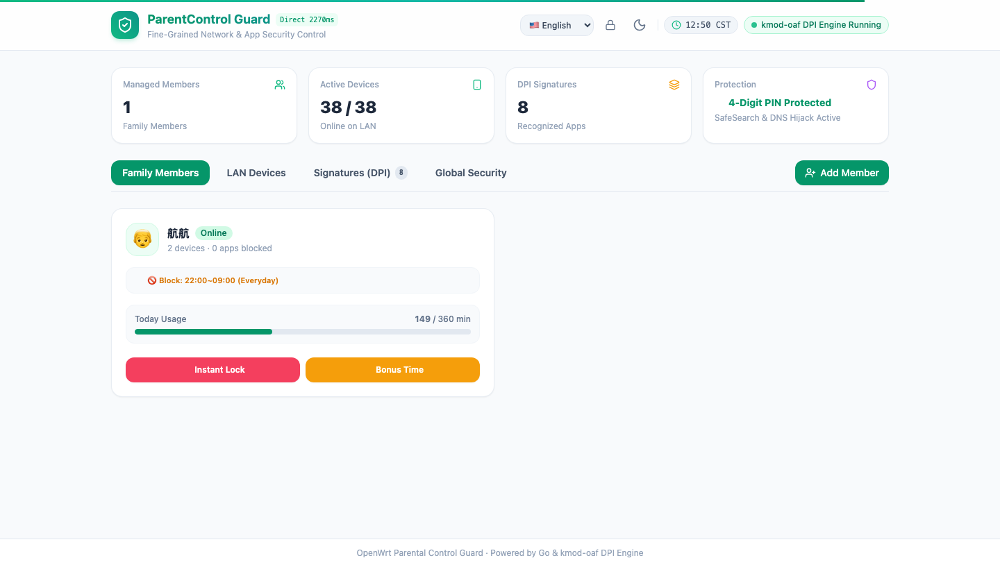
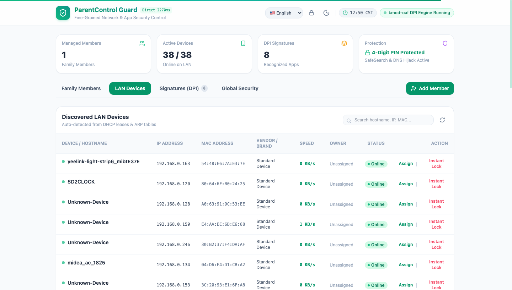
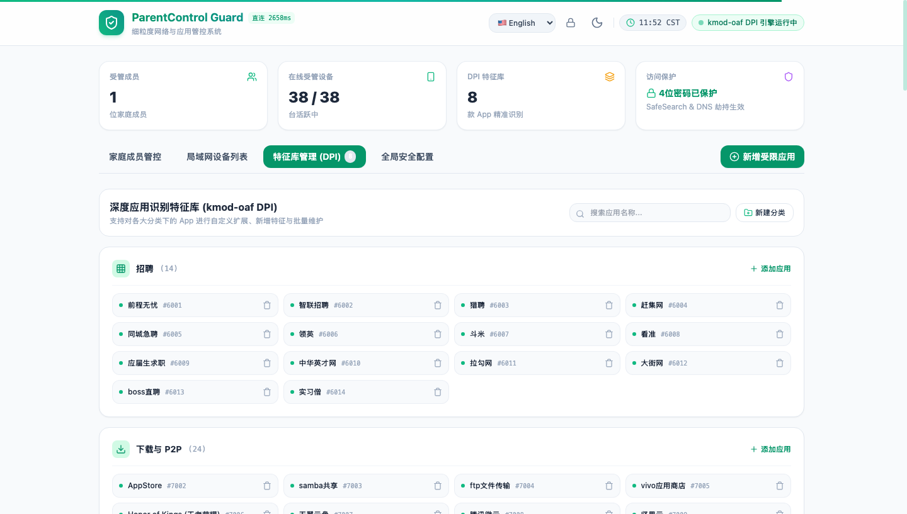
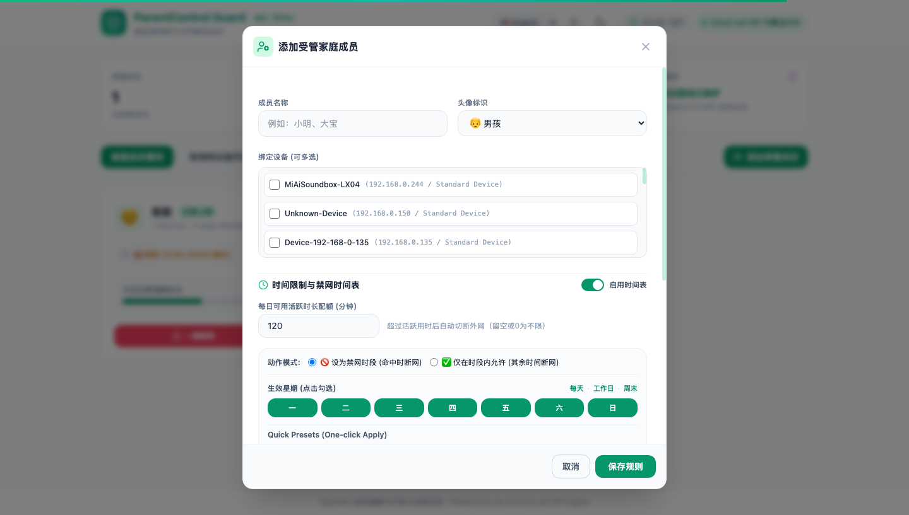
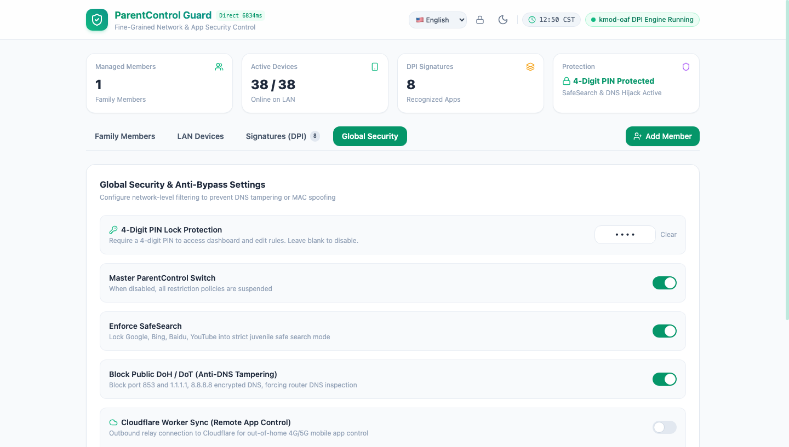
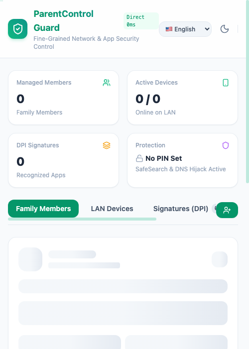
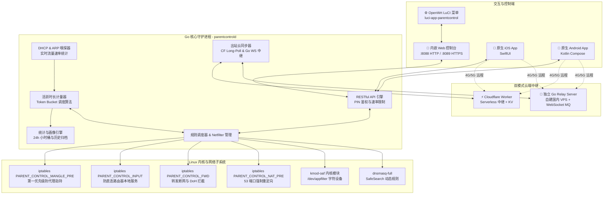

<div align="center">

# 🛡️ ParentControl Guard (OpenWrt 家长控制卫士)

**基于 Go 与内核级 DPI 深度包检测的 OpenWrt 细粒度家长控制与上网行为安全管理系统**

[](https://github.com/hamguy/parent-control/actions/workflows/ci.yml)
[](https://github.com/hamguy/parent-control/actions/workflows/release.yml)
[](https://golang.org)
[](https://swift.org)
[](https://openwrt.org)
[](LICENSE)
[](https://github.com/hamguy/parent-control/releases)
[](CONTRIBUTING_zh.md)

[English](README.md) | [简体中文](README_zh.md)

</div>

---

## 📖 项目简介

**ParentControl Guard** 是一套专为 **OpenWrt** 固件及各类智能路由器/软路由网关量身打造的细粒度家长控制与青少年绿色上网安全管理系统。

系统核心采用高效的 **Go** 语言守护进程配合 Linux 内核级 **`kmod-oaf`** 七层深度包检测 (DPI) 引擎，在极低 CPU 与内存占用下，实现对家庭内网设备的精准应用识别、精细化时间与配额管控、防沉迷禁网及全方位防绕过拦截。

项目自带单文件内嵌的 **现代化响应式 Web 控制台**、共享纯 **Swift** 跨平台业务核心的原生 **iOS (SwiftUI)** 与 **Android** 客户端，并提供基于 **Cloudflare Workers** 的无服务器云端中继，让家长在 4G/5G 外网环境下无需公网 IP 即可远程管理家中网络。

---

## ✨ 核心特性

| 功能模块 | 亮点特性说明 |
| :--- | :--- |
| 📱 **独立 Web 控制台** | 单二进制内嵌，零外部运行时依赖，支持手机端/PC端自适应、明暗主题切换、4位数字 PIN 密码锁与 8 种国际化语言。 |
| 🍎 **原生跨平台移动端** | iOS 纯 **SwiftUI** 构建与 Android Kotlin Compose 原生界面，通过 C-FFI / JNI 共享纯 **Swift** 跨平台业务与网络核心 (`ParentControlCore`)。 |
| 🎮 **内核级 L7 DPI 引擎** | 基于 `kmod-oaf` 内核模块与协议指纹库，精准识别并封禁数百款主流 App（王者荣耀、和平精英、原神、Steam、抖音、快手、TikTok、YouTube、B站等）。 |
| ⏱️ **多时段计划与活跃限额** | 支持按星期与多时间段自定义禁网计划（支持跨夜），结合实际人机交互流量的 Token Bucket 每日限额、一键断网 (Instant Lock) 与奖励临时加时 (+15m/+30m/+1h)。 |
| 🛡️ **立体多层防绕过体系** | 在 `mangle` 表 `PREROUTING` 第一优先级截杀，无惧 OpenClash / Passwall 代理旁路；强制锁定 Google/Bing/Baidu 青少年 SafeSearch，封锁外部公共 DoH/DoT (853/443端口)，防范随机 MAC 绕过。 |
| 📊 **时长统计与行为画像** | 精准记录每台设备的 24 小时活跃时长分布、DPI 分类时长占比与 30 天历史趋势，内置底噪心跳过滤算法，真实还原人机使用时长。 |
| ☁️ **双模式云端远程中继** | 支持 **Cloudflare Workers & KV** 无服务器中继，以及基于 **Go + In-Memory MQ + WebSocket** 的自建国内 VPS 中继服务器，4G/5G 外网毫秒级远程管控。 |

---

## 🖼️ 界面截图预览

<div align="center">

### 📱 现代化 Web 控制台大屏

| 🔒 安全访问密码锁 (PIN 保护) | 📊 主控制台与成员管理概览 |
| :---: | :---: |
|  |  |

| 🌐 局域网设备探测与一键断网 | 🎮 深度 L7 DPI 应用特征库 (8大分类) |
| :---: | :---: |
|  |  |

| ⏱️ 成员多时间段计划与特征封禁配置 | ⚙️ 全局安全、防绕过与国内 VPS / CF 同步 |
| :---: | :---: |
|  |  |

| 📱 移动端自适应视图 (手机竖屏) |
| :---: |
|  |

</div>

---

## 🏛️ 系统架构



---

## 📁 目录结构

```text
.
├── cmd/
│   └── parentcontrold/          # Go 守护进程入口
├── internal/
│   ├── api/                     # RESTful API 路由、中间件与 TLS 证书生成
│   ├── cloud/                   # Cloudflare Worker 同步与指令消费模块
│   ├── config/                  # JSON 配置持久化管理
│   ├── device/                  # DHCP 租约与 ARP 状态嗅探
│   ├── dpi/                     # kmod-oaf DPI 接口与特征库解析
│   ├── firewall/                # iptables 自定义链与 NAT 规则管理
│   ├── models/                  # 核心数据模型与 JSON 结构体定义
│   ├── quota/                   # 活跃时长统计与多时间段调度引擎
│   └── safedns/                 # SafeSearch dnsmasq 规则生成与 DoH 拦截
├── web/                         # 内嵌 Web 控制台前端源码 (HTML5, Tailwind, Lucide)
├── client/
│   ├── ParentControlCore/       # 通用纯 Swift 跨平台包 (Models, API, JNI C-FFI)
│   ├── iOS/                     # iOS SwiftUI 原生应用 (XcodeGen & .xcodeproj)
│   └── Android/                 # Android 原生应用 (Kotlin, Jetpack Compose, JNI)
├── cloud/
│   └── worker/                  # Cloudflare Worker 远程中继源码 (TypeScript & Wrangler)
├── rootfs/                      # OpenWrt 部署文件 (init.d 服务、LuCI 菜单与 ACL)
├── docs/                        # 深度架构、接口与跨平台复用文档
├── scripts/                     # 自动化编译、打包与一键部署脚本
├── .github/                     # GitHub Actions CI/CD 流水线
├── Makefile                     # 编译与打包指令
├── LICENSE                      # MIT 开源许可证
└── README_zh.md
```

---

## 🚀 快速上手与安装

### 方式 1：安装预编译 IPK（推荐终端用户）

在 [GitHub Releases](../../releases) 页面下载对应路由器 CPU 架构的 `.ipk` 安装包：

```bash
# 上传安装包至路由器
scp luci-app-parentcontrol_1.0.0-1_x86_64.ipk root@192.168.1.1:/tmp/
ssh root@192.168.1.1

# 在 OpenWrt 终端执行安装
opkg update
opkg install /tmp/luci-app-parentcontrol_1.0.0-1_x86_64.ipk

# 启用并启动系统服务
/etc/init.d/parentcontrol enable
/etc/init.d/parentcontrol start
```

### 方式 2：开发者一键脚本部署

克隆代码仓库后，通过一键部署脚本快速编译并推送到目标路由器：

```bash
git clone https://github.com/hamguy/parent-control.git
cd parent-control

# 赋予执行权限并运行部署脚本
chmod +x scripts/deploy.sh
./scripts/deploy.sh
```

### 方式 3：使用 Makefile 交叉编译

```bash
# 编译 Linux amd64 二进制文件
make build

# 构建特定架构的 OpenWrt IPK 包 (如 aarch64, mips_24kc, x86_64)
make ipk ARCH=aarch64 VERSION=1.0.0-1

# 运行后端单元测试
make test
```

---

## 📱 原生移动端控制

### 🍏 iOS 客户端 (SwiftUI)
- **系统要求**：iOS 16.0+, macOS Sonoma+, Xcode 15+
- **打开工程**：直接在 Xcode 中打开 `client/iOS/ParentControl.xcodeproj`。
- **重新生成工程**（可选）：运行 `cd client/iOS && xcodegen generate`。
- **特性**：原生触觉震动反馈、深色模式支持、局域网路由器自动嗅探发现、PIN 码锁屏与本地离线缓存。

### 🤖 Android 客户端 (Jetpack Compose)
- **系统要求**：Android 8.0+ (API Level 26+), Android Studio Hedgehog+
- **打开工程**：在 Android Studio 中打开 `client/Android`。
- **Swift 核心共享**：通过 `client/ParentControlCore` 生成的 `libParentControlBridge.so` 动态库与 Kotlin 协程无缝对接。详见 [Android Swift 跨平台复用指南](docs/ANDROID_SWIFT_INTEROP_zh.md)。

---

## ☁️ 公网远程同步配置（可选）

若需在离开家庭 Wi-Fi 时通过手机移动网络远程管理路由器：

1. 按照 [Cloudflare Worker 部署指南](cloud/worker/README_zh.md) 部署免费的 Worker：
   ```bash
   cd cloud/worker
   npm install
   npx wrangler kv:namespace create PARENT_CONTROL_KV
   npx wrangler deploy
   ```
2. 在路由器 Web 控制台的 **【全局安全配置】** 中开启 **Cloudflare Worker 远程同步**，填入部署好的 Worker URL 与自定义 Secret Key 即可。

---

## 📚 详细文档索引

| 文档名称 | 核心内容说明 |
| :--- | :--- |
| 📐 [系统架构与原理](docs/ARCHITECTURE_zh.md) ([English](docs/ARCHITECTURE.md)) | 详细解读系统层次划分、Netfilter 数据流转、DPI 过滤流程与配额调度算法。 |
| 🔌 [RESTful API 规范](docs/API_zh.md) ([English](docs/API.md)) | 完整列出所有 HTTP 接口端点、请求格式、响应结构体与鉴权机制。 |
| 🛠️ [路由器端部署与运维指南](docs/DEPLOYMENT_zh.md) ([English](docs/DEPLOYMENT.md)) | 生产环境详细部署步骤、init.d 服务管理、防火墙排错与实时日志调试。 |
| 🌐 [国内 VPS 自建 Go Relay Server 部署指南](docs/DEPLOYMENT_RELAY_SERVER_zh.md) ([English](docs/DEPLOYMENT_RELAY_SERVER.md)) | 针对无法访问 Cloudflare 的地区，提供基于 Go 的中继服务器搭建方案。 |
| ❓ [常见问题解答 (FAQ)](docs/FAQ_zh.md) ([English](docs/FAQ.md)) | 包含 HTTPS 自签名证书授权、随机 MAC 绕过应对、PIN 码重置等高频问题。 |
| 🌉 [Android Swift 核心复用指南](docs/ANDROID_SWIFT_INTEROP_zh.md) ([English](docs/ANDROID_SWIFT_INTEROP.md)) | 深入探讨如何将 Swift Package 编译为 JNI 动态库并在 Android 中复用。 |
| ⚡ [Cloudflare Worker 中继说明](cloud/worker/README_zh.md) ([English](cloud/worker/README.md)) | 无服务器云端中继部署步骤与 KV 命名空间绑定指南。 |

---

## ⚙️ 核心配置文件示例

系统规则默认存储于 `/etc/parentcontrol/config.json`：

```json
{
  "enabled": true,
  "pin_code": "1234",
  "enforce_safe_search": true,
  "block_doh_dot": true,
  "isolate_new_devices": false,
  "cloud_sync_enabled": false,
  "cloud_worker_url": "",
  "cloud_device_secret": "",
  "members": [
    {
      "id": "m_1",
      "name": "Alex",
      "avatar": "boy",
      "enabled": true,
      "quota_minutes": 120,
      "device_macs": ["AA:BB:CC:DD:EE:FF"],
      "blocked_app_ids": [2001, 2002, 2023],
      "schedule": {
        "enabled": true,
        "days": [1, 2, 3, 4, 5],
        "action": "block",
        "time_ranges": [
          { "start_time": "21:30", "end_time": "07:00" }
        ]
      }
    }
  ]
}
```

---

## 🤝 参与贡献

我们欢迎社区各类形式的贡献（问题反馈、文档优化、补充新应用特征、提交代码）：

- 请在提交前阅读 [贡献指南](CONTRIBUTING_zh.md) ([English](CONTRIBUTING.md))。
- 如发现安全问题，请参阅 [安全策略](SECURITY_zh.md) ([English](SECURITY.md)) 进行私密反馈。

---

## 📄 开源许可证

本项目采用 **MIT License** 开源许可证。详见 [`LICENSE`](LICENSE) 文件。

---

## 💖 致谢与依赖项目

- [OpenWrt Project](https://openwrt.org/) — 开源无线路由器固件基石。
- [kmod-oaf](https://github.com/destan19/OpenAppFilter) — OpenAppFilter 开源内核 DPI 引擎。
- [Lucide Icons](https://lucide.dev/) — 现代化的图标设计资源。
- [Tailwind CSS](https://tailwindcss.com/) — 实用优先的高效 CSS 框架。
